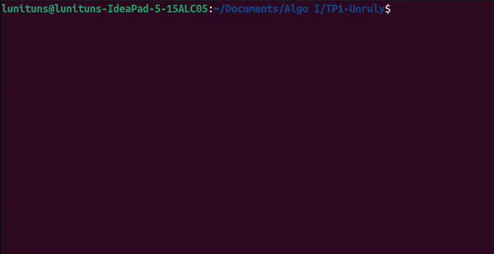

# Trabajo Práctico 1: Unruly

Se incluye el código fuente del Trabajo Práctico N°1. La consigna consistía en implementar una versión simplificada del juego _Unruly_ por consola.

Los detalles del enunciado y especificaciones están disponibles en el siguiente [link](https://algoritmos1rw.ddns.net/tps/2023-c1/tp1).

## Ejemplo de ejecución

