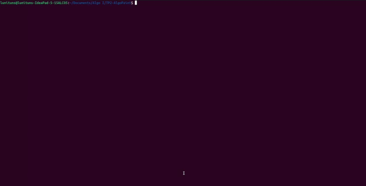

# Trabajo Práctico 2: AlgoPaint

Se incluye el código fuente del Trabajo Práctico N°2. La consigna consistía en implementar una versión propia del _Paint_, con una interfaz gráfica. Para esto se debía utilizar la librería [Gamelib](https://github.com/dessaya/python-gamelib) desarrollada por el jefe de cátedra.

Los detalles del enunciado y especificaciones están disponibles en el siguiente [link](https://algoritmos1rw.ddns.net/tps/2023-c1/tp2).

## Ejemplo de ejecución

