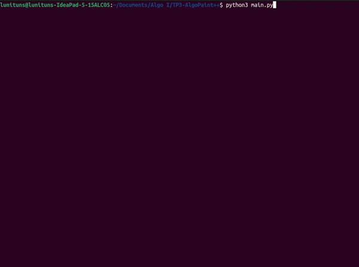

# Trabajo Práctico 3: AlgoPaint++

Se incluye el código fuente del Trabajo Práctico N°3. En este caso, el objetivo era agregar funcionalidades nuevas al _Paint_ desarrollado para el anterior trabajo:

- Balde de pintura
- Deshacer y rehacer

Los detalles del enunciado y especificaciones están disponibles en el siguiente [link](https://algoritmos1rw.ddns.net/tps/2023-c1/tp3).

## Ejemplo de ejecución

